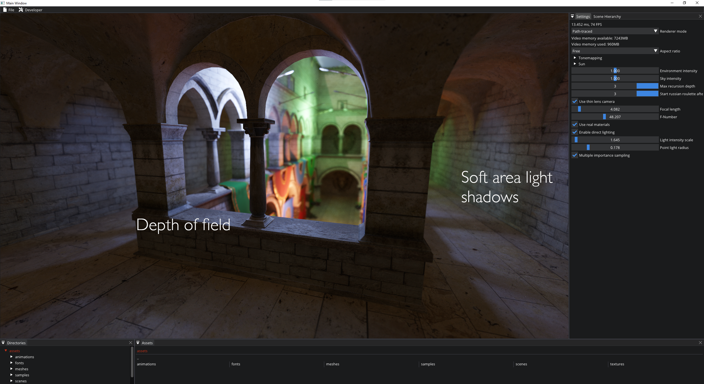

# D3D12Renderer

This project implements a custom rendering engine build from the ground up in C++ using Direct3D 12. 
It supports some "new" features like raytracing, mesh shaders etc. 

It also features a custom written physics engine written completely from scratch.

## Table of Contents
- [Graphics](#graphics-features)
- [Physics](#physics-features)
- [Other](#other-features)
- [System Requirements](#system-requirements)
- [Build Instructions](#build-instructions)
- [Locomotion Learning](#locomotion-learning)

## Graphics features

- Forward+ rendering
- Physically based rendering
- Dynamic lights and dynamic shadows
	- Sun (with cascaded shadow maps)
	- Point lights
	- Spot lights
- Decals
- Post processing stack
	- Temporal anti-aliasing
	- Horizon-based ambient occlusion
	- Screen space shadows
	- Bloom
	- Filmic tone-mapping
	- Sharpening
- Tiled light and decal culling
- Screen space reflections
- Real-time raytracing (DXR)
- Integrated path tracer
- Skeletal animation
- Mesh shaders
- Hot-reloading of shaders

It has an integrated (albeit pretty simple) path tracer (using hardware-accelerated raytracing), which in the future will be integrated into the real-time pipeline in some form to compute global illumination effects.

 

## Physics features

Images to the right are links to YouTube videos showcasing the various physics features.

- Rigid body dynamics
- Cloth simulation
- Various constraints between rigid bodies (many with limits and motors)
  - Distance
  - Ball joints
  - Hinge joints
  - Cone twist
  - Slider
- Various collider types
  - Spheres
  - Capsules
  - Cylinders
  - AABBs and OBBs
  - Arbitrary convex hulls
- SIMD support for constraint resolution (SSE4 and AVX2)
- Ragdolls
- Vehicle physics
- Machine learning for ragdoll locomotion. Based on [Machine Learning Summit: Ragdoll Motion Matching](https://www.youtube.com/watch?v=JZKaqQKcAnw) and [DReCon: Data-Driven Responsive Control of Physics-Based Characters](https://static-wordpress.akamaized.net/montreal.ubisoft.com/wp-content/uploads/2019/11/13214229/DReCon.pdf) by Ubisoft. See [below](#locomotion-learning).

## Other features

- Editor tools
- Integrated CPU and GPU profiler (with multi-threading support)

## System Requirements

Since this project uses Direct3D 12 as the only rendering backend, the only supported platforms are Windows 10 or higher. 
The project is only tested with Visual Studio 2019 and 2022, and only on NVIDIA GPUs.

For mesh shaders you will need the Windows 10 SDK version 10.0.19041.0 or higher.
This can be downloaded using the Visual Studio Installer.
If you only have an older version of the SDK installed, the build system will automatically disable mesh shaders. 
To run you will need the Windows 10 May 2020 Update (20H1) or newer.
If these requirements are not met, you should still be able to build and run the program, but without mesh shader support.

If you want to use raytracing or mesh shaders, you need a compatible NVIDIA GPU. 
For raytracing these are the GPUs with the Pascal architecture or newer.
For mesh shaders you will need a Turing GPU or newer.

The project files are currently generated with the AVX2 instruction set. 
If your processor does not support this, set another instruction set (either in Visual Studio or in premake5.lua).

All other dependencies (external libraries) either come directly with the source code or in the form of submodules.

## Build Instructions

I have tried to keep the build process as simple as possible.
Therefore you will not need any build tools installed on your machine.
The project uses Premake, but all you need comes with the source.
See also the video linked to the right for detailed instructions.

- Clone the repository and make sure to clone with submodules. 
- Double-click either the _generate2019.bat_ or _generate2022.bat_ file in the root directory to generate a Visual Studio 2019 or 2022 solution, respectively.
The build process will automatically enable and disable certain features based on your installed GPU and the available Windows 10 SDK.
- Open the solution and build. 
This _should_ work directly. 
Visual Studio sometimes reports an "Unspecified error" when building. 
In that case either restart Visual Studio or re-generate the project (_generate.bat_) and you are good to go.
- If you add new source files (or shaders), re-run the _generate\*.bat_ file.

The assets seen in the screenshots above are not included with the source code. 

## Locomotion Learning

This project implements a very simplified version of learned ragdoll locomotion.
The ragdoll is constructed of various separate rigid bodies, connected with hinge constraints on elbows and knees, and cone twist constraints on shoulders, hips, neck etc.
Currently the ragdoll only learns to stand upright, by controlling forces applied to all these constraints.
It can withstand minor forces.

The neural network has a very simple structure.
It only features two fully connected layers with a tanh activation.
It is trained using the [Proximal Policy Optimization Algorithm (PPO)](https://arxiv.org/abs/1707.06347), implemented in [`stable-baselines3`](https://stable-baselines3.readthedocs.io/en/master/index.html).

### Learning

The training is implemented in PyTorch, so you'll need to install Python 3.x and some packages.
I am using Miniconda, but the steps below should work fine with just Python (replace `conda` calls with `pip`).

To set up the enviroment, in the Anaconda Powershell execute the following commands (depending on installation, maybe you'll need to start as administrator):
- `conda create --name learning`
- `conda activate learning`
- `conda install pytorch cpuonly -c pytorch` (I'm training on the CPU, but feel free to experiment with training on CUDA)
- `pip install stable-baselines3`

To start the training:
- Build the C++ code (see [above](#build-instructions)) in a Release build. This builds a separate DLL (_Physics-DLL.dll_), which is accessed by the Python code.
- In the Anaconda Powershell, navigate to root directory of this project.
- `python ./learning/learn_locomotion.py`
- Wait a couple of hours.
- You can cancel and continue the training at any time. Just set the variable `start_from_pretrained` inside _learning/learn_locomotion.py_ to `True`.

### Inference

I didn't feel like linking against the huge `libtorch` C++ library for inference of such a simple network, so I wrote the inference myself.
Thus, after learning, execute the following command to export the layer weights and biases from Python to a text file: `python ./learning/convert_model_to_c++.py`.
Then rebuild the C++ code.
The weights then get compiled automatically into the C++ executable.

